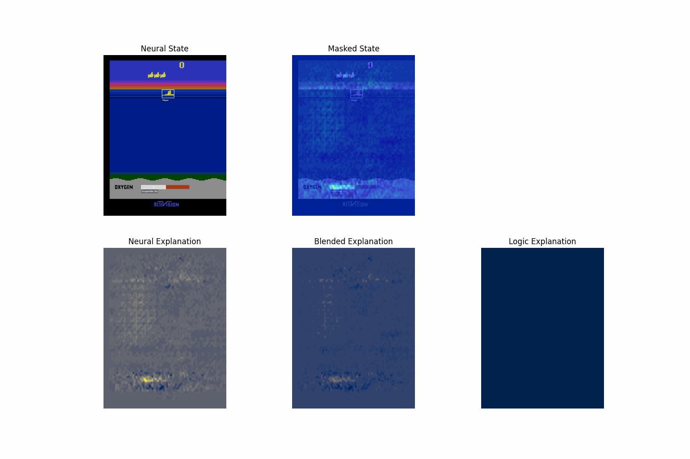

Here, we illustrate how BlendRL's explanations evolve over time. The top row presents input images with blended explanations integrated onto them. The bottom section displays individual explanations from the neural and logic modules, along with the blended explanations.

